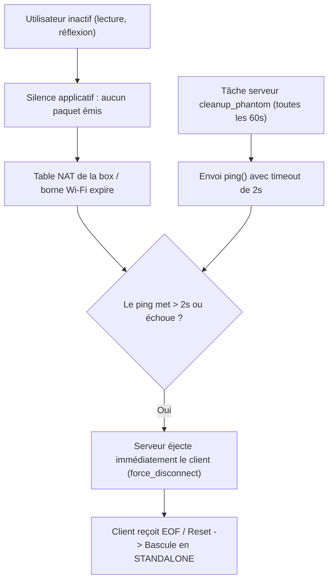
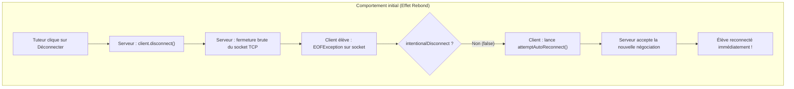
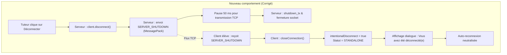

# Bilan Technique : Résilience Réseau, Déconnexions Wi-Fi et Éjection Distante

> **Date** : 14-15 septembre 2026  
> **Projet** : CodeLab (Client v2 Java & Serveur Rust)  
> **Auteur** : Antigravity & Jérôme Lehuen  

---

## 1. Contexte & Problématique Globale

En mode connecté, le client CodeLab interagit en temps réel avec le serveur distant (`codelab-serv.univ-lemans.fr:9988`) pour superviser les sessions de travaux pratiques (suivi enseignant, consultation de code, contrôle à distance).

Cette infrastructure a été confrontée à deux défis réseau complémentaires :
1. **Les micro-coupures et déconnexions intempestives en Wi-Fi** : les étudiants et enseignants subissaient des déconnexions soudaines en cours de séance avec affichage d'une boîte modale d'erreur (`NETWORK ERROR : Perte de la connexion avec le serveur`) et basculement non désiré vers le mode autonome (`Statut.STANDALONE`).
2. **L'effet rebond lors d'une déconnexion ordonnée à distance** : suite à l'introduction d'un mécanisme de reconnexion automatique en arrière-plan pour pallier ces coupures Wi-Fi, lorsqu'un tuteur forçait la déconnexion d'un élève depuis l'interface d'administration, le client élève interprétait cette coupure comme un incident réseau et se reconnectait aussitôt en silence.

Ce document présente l'analyse conjointe de ces deux phénomènes et l'architecture mise en œuvre pour garantir à la fois une résilience réseau maximale et le respect strict des ordres administratifs d'éjection.

---

## 2. Volet 1 : Résilience Réseau et Déconnexions Wi-Fi

### 2.1. Analyse des Traces Réelles du Serveur

L'inspection des journaux réels du serveur Rust ([`temp/server.log`](file:///Users/lehuen/dev/codelab/server/temp/server.log)) a mis en évidence le mécanisme précis des coupures intempestives.

#### Cas concret observé sur la session de Jérôme
À la ligne 2948 de [`temp/server.log`](file:///Users/lehuen/dev/codelab/server/temp/server.log#L2946-L2949) :
```text
2025-09-15 19:53:10 - Initializing lehuen (TUTOR) with session IntroProg_TP3
2025-09-15 19:53:32 - Initializing lehuen (TUTOR) with session IntroProg_TP4
2025-09-15 19:55:33 - Cleaning phantom connection: lehuen
2025-09-15 19:55:33 - Force ejection of lehuen (ghost connection)...
```
**Constat** : Exactement deux minutes après l'initialisation de la session, la tâche d'arrière-plan du serveur a classé la connexion comme « fantôme » et a déclenché une éjection forcée (`force_disconnect`), fermant unilatéralement le socket depuis le serveur.

#### Erreurs récurrentes sur les postes étudiants
L'analyse des journaux enregistre trois codes d'erreurs fréquents :
- `Connection reset by peer (os error 104)` : le routeur ou le client a émis un paquet TCP RST car la liaison était rompue côté client.
- `Connection timed out (os error 110)` : absence d'ACK TCP après plusieurs retransmissions.
- `No route to host (os error 113)` : borne Wi-Fi temporairement inaccessible ou changement de passerelle réseau (roaming AP).

---

### 2.2. Causes Racines Identifiées

<style>
/* 1. Rendu responsive */
svg {
  max-width: 100% !important;
  height: auto !important;
}

/* 2. Typographie générale */
.mermaid text, svg text {
  font-size: 19px !important;
}

/* 3. Titres des conteneurs / clusters (subgraphs) */
.cluster text {
  font-size: 20px !important;
  font-weight: bold !important;
}

/* 4. Texte à l'intérieur des boîtes (nœuds) */
.node text, .node .label, .nodeLabel {
  font-size: 21px !important;
}

/* 5. Libellés sur les arcs (décalés pour ne jamais chevaucher la ligne) */
.edgeLabel text {
  font-size: 17px !important;
  transform: translateY(-18px) !important;
}

/* 6. Suppression de l'artefact de fond rectangulaire sous les libellés d'arcs */
.edgeLabel rect {
  display: none !important;
}

/* 7. Lignes pointillées transformées en tirets nets et visibles */
.edge-pattern-dotted, .edge-pattern-dashed, path[style*="stroke-dasharray"] {
  stroke-dasharray: 8 4 !important;
}

/* 8. Lignes de liaison des flèches plus épaisses */
.edgePath .path, .flowchart-link {
  stroke-width: 2.5px !important;
}

/* 9. Pointes de flèches agrandies et centrées */
marker {
  overflow: visible !important;
}
.arrowMarkerPath, .arrowheadPath, marker path {
  transform: scale(1.6);
  transform-box: fill-box;
  transform-origin: center;
  fill: context-stroke !important;
  stroke: context-stroke !important;
}
</style>



1. **Watchdog serveur trop agressif sans tolérance aux pannes** :
   Dans [`connected.rs`](file:///Users/lehuen/dev/codelab/server/server/src/connected.rs#L387-L431) et [`server.properties`](file:///Users/lehuen/dev/codelab/server/server/config/server.properties#L14-L17), le serveur exécute `cleanup_phantom_connections()` toutes les minutes avec `socket_timeout = 2s`. En Wi-Fi, la gigue, les interférences ou le réveil après veille éco-énergie peuvent faire dépasser 2 secondes à un paquet. Dès ce premier dépassement, le serveur éjectait le client sans aucun retry.
2. **Silence applicatif côté client et purge des tables NAT** :
   Dans [`CodelabClient.java`](file:///Users/lehuen/dev/codelab/client/src/codelab/client/CodelabClient.java#L115-L121), la tâche périodique n'émettait rien si le code n'avait pas été modifié (`if (!editor.isModified()) return;`). Lors des périodes de réflexion sans frappe, aucun paquet ne circulait, conduisant les box Wi-Fi et routeurs NAT à clore prématurément l'état de routage du socket après 60 à 180 secondes.
3. **Absence des options TCP Keep-Alive** :
   Le socket Java était instancié sans `SO_KEEPALIVE`, empêchant l'OS d'émettre des sondes de maintien bas niveau.
4. **Absence de résilience en cas de micro-coupure** :
   Dans [`CommandHandler.java`](file:///Users/lehuen/dev/codelab/client/src/codelab/client/CommandHandler.java#L55-L62), toute rupture de socket déclenchait directement `client.connectionBroken()`, abandonnant immédiatement la session sans tentative de reconnexion, alors que les identifiants étaient disponibles en mémoire.

---

### 2.3. Résolution Côté Client Java

#### 1. Configuration Optimale du Socket TCP
Dans [`CodelabClient.java`](file:///Users/lehuen/dev/codelab/client/src/codelab/client/CodelabClient.java) :
```java
socket = new Socket(SERVER_NAME, SERVER_PORT);
socket.setKeepAlive(true);    // Active les sondes TCP Keep-Alive de l'OS
socket.setTcpNoDelay(true);   // Désactive l'algorithme de Nagle (transmission temps réel)
```

#### 2. Heartbeat Applicatif Périodique (Ping régulier)
Dans `startRegularTimer()` de [`CodelabClient.java`](file:///Users/lehuen/dev/codelab/client/src/codelab/client/CodelabClient.java) :
```java
TimerTask task_heartbeat = new TimerTask() {
    public void run() {
        if (isConnected()) ping();
    }
};
timer.schedule(task_heartbeat, 15000, 30000); // Émission toutes les 30 secondes
```
Ce flux périodique maintient actives en permanence les tables de translation d'adresses (NAT) des routeurs et bornes Wi-Fi.

#### 3. Thread de Reconnexion Automatique Transparente (`AutoReconnectThread`)
En cas de perte de flux imprévue (`connectionBroken`), le client ne bascule plus immédiatement en mode autonome :
- Un thread dédié effectue jusqu'à 5 tentatives espacées de 2 secondes.
- Les identifiants et la session courante en mémoire sont réutilisés.
- Si le serveur retourne `ERROR_CONNECTED` (socket fantôme précédent encore référencé), le client envoie automatiquement `EJECTION` pour libérer la place avant de réussir sur l'essai suivant.
- Le fichier en cours d'édition est sauvegardé localement par précaution et restauré après réinitialisation de la session (`INIT_SESSION`).
- Ce n'est qu'après épuisement complet des 5 tentatives infructueuses que le dialogue d'erreur s'affiche et que le client bascule en mode autonome (`STANDALONE`).

---

### 2.4. Ajustements Recommandés Côté Serveur Rust

Dans [`config/server.properties`](file:///Users/lehuen/dev/codelab/server/server/config/server.properties) :
```ini
[cleanup]
phantom_interval = 60 # Intervalle d'évaluation (en secondes)
socket_timeout = 10    # Augmentation du seuil de 2s à 10s pour absorber la latence Wi-Fi
```
*Tolérance aux pannes dans [`connected.rs`](file:///Users/lehuen/dev/codelab/server/server/src/connected.rs)* : mise en place d'un compteur d'échecs (2 à 3 tentatives consécutives non répondues) avant de prononcer l'expulsion définitive `force_disconnect`.

---

## 3. Volet 2 : Maîtrise de l'Auto-Reconnexion et Éjection Distante

### 3.1. Symptôme de l'Effet Rebond

Dès la mise en service de l'auto-reconnexion, une anomalie fonctionnelle est apparue lors de la gestion de classe :
> Lorsqu'un enseignant ou tuteur forçait la déconnexion d'un étudiant depuis la table des utilisateurs (`UserTable`) ou la console web, l'étudiant réapparaissait quasi immédiatement dans la session.

L'éjection ordonnée était rendue inopérante par la ténacité du thread de reconnexion automatique.

---

### 3.2. Cause Racine : Manque de Signalisation Applicative

<style>
/* Réutilisation de la charte CSS Mermaid standard */
svg { max-width: 100% !important; height: auto !important; }
.mermaid text, svg text { font-size: 19px !important; }
.cluster text { font-size: 20px !important; font-weight: bold !important; }
.node text, .node .label, .nodeLabel { font-size: 21px !important; }
.edgeLabel text { font-size: 17px !important; transform: translateY(-18px) !important; }
.edgeLabel rect { display: none !important; }
.edge-pattern-dotted, .edge-pattern-dashed, path[style*="stroke-dasharray"] { stroke-dasharray: 8 4 !important; }
.edgePath .path, .flowchart-link { stroke-width: 2.5px !important; }
marker { overflow: visible !important; }
.arrowMarkerPath, .arrowheadPath, marker path {
  transform: scale(1.6);
  transform-box: fill-box;
  transform-origin: center;
  fill: context-stroke !important;
  stroke: context-stroke !important;
}
</style>



Le serveur fermait le socket TCP via `shutdown_tx.send(true)` sans transmettre au préalable de message MessagePack informant le client de son expulsion. Côté client, la coupure brute était vue comme une perte de signal Wi-Fi ; `intentionalDisconnect` valant `false`, le client réenclenchait instantanément sa routine de négociation.

---

### 3.3. Correctifs Appliqués

Pour résoudre définitivement le problème, le protocole distingue désormais formellement une rupture accidentelle d'une fermeture administrative ordonnée par le serveur :



#### A. Côté Serveur Rust ([`server/server/src/client.rs`](file:///Users/lehuen/dev/codelab/server/server/src/client.rs#L360-L372))
Dans `client.disconnect()`, le serveur avertit explicitement le client distant avant de fermer le socket :

```rust
    // Pour déconnecter proprement le client
    pub async fn disconnect(&self) -> EmptyResult {
        // Avertir le client distant pour qu'il ferme proprement sans déclencher d'auto-reconnexion
        let _ = self.server_shutdown().await;
        sleep(Duration::from_millis(50)).await;

        if let Err(e) = self.shutdown_tx.send(true) {
            log::warn!("Failed to send shutdown signal to {:?}: {}", self.login, e);
        }
        Ok(())
    }
```
*Note : Le délai de 50 ms garantit que le paquet réseau quitte les tampons système avant que le runtime Tokio ne mette fin au socket.*

#### B. Côté Client Java ([`client/src/codelab/client/CodelabClient.java`](file:///Users/lehuen/dev/codelab/client/src/codelab/client/CodelabClient.java#L1128-L1135))
À la réception du message `SERVER_SHUTDOWN` décodé par `CommandHandler` :
1. `closeConnection()` est invoqué : il positionne `intentionalDisconnect = true`, arrête les minuteries (dont le heartbeat), sauvegarde localement les fichiers, ferme le socket et bascule l'interface en `Statut.STANDALONE`.
2. Lorsque le socket distant se ferme consécutivement, `connectionBroken()` constate que `intentionalDisconnect == true` et **n'enclenche aucune auto-reconnexion**.
3. Une boîte de dialogue modale standard informe l'élève de la décision pédagogique via la clé internationalisée `MepaClient_0` :

```java
	public synchronized void SERVER_SHUTDOWN() {
		closeConnection();
		SwingUtilities.invokeLater(() -> {
			Utils.showMessageDialog("INFORMATION", CodeLab.LABEL("MepaClient_0"));
		});
	}
```

*Clé correspondante dans [`syslang.properties`](file:///Users/lehuen/dev/codelab/client/data/syslang.properties#L248) :*
- **FR** : `Vous avez été déconnecté(e) par le serveur`
- **EN** : `You have been disconnected by the server`

---

## 4. Validation, Tests & Déploiement

### 4.1. Validation des Compilations
1. **Serveur Rust** : Exécution de `cargo check` dans [`server/server`](file:///Users/lehuen/dev/codelab/server/server) validée sans aucune erreur.
2. **Client Java** : Exécution de [`./build.sh`](file:///Users/lehuen/dev/codelab/client/build.sh) validée, génération du JAR `hidden/codelab/codelab.jar` avec succès.

### 4.2. Procédure de Déploiement Serveur en Production
Pour appliquer le binaire Rust sur l'infrastructure universitaire :
```bash
cd ~/dev/codelab/server
# 1. Synchronisation des sources Rust vers le serveur
scp server/src/*.rs codelab@codelab-serv.univ-lemans.fr:~/codelab-server/server/src/
# 2. Compilation et redémarrage du service
ssh codelab@codelab-serv.univ-lemans.fr "cd ~/codelab-server && ./compile-server.sh && ./run-server.sh"
```

### 4.3. Distribution Client
Génération des paquets installateurs finaux via les scripts dédiés :
- macOS (universel arm64 / x86_64) : [`distrib-mac.sh`](file:///Users/lehuen/dev/codelab/client/distrib-mac.sh)
- Linux (paquet autonome + raccourcis FreeDesktop) : [`distrib-linux.sh`](file:///Users/lehuen/dev/codelab/client/distrib-linux.sh)
- Windows (exécutable + raccourci portable) : [`distrib-win64.sh`](file:///Users/lehuen/dev/codelab/client/distrib-win64.sh)
- Global : [`distrib-all.sh`](file:///Users/lehuen/dev/codelab/client/distrib-all.sh)

---

## 5. Synthèse Matricielle des Mesures

| Problématique | Composant | Action Technique | Bénéfice Opérationnel | Statut |
| :--- | :--- | :--- | :--- | :--- |
| **Purge des tables NAT Wi-Fi** | Client Java | Heartbeat périodique (`ping()` toutes les 30s) | Maintien actif des sessions lors des temps de réflexion | **En production** |
| **Perte de flux bas niveau** | Client Java | `setKeepAlive(true)` & `setTcpNoDelay(true)` | Sondes de maintien OS et réactivité TCP maximale | **En production** |
| **Micro-coupures Wi-Fi** | Client Java | Thread de reconnexion automatique (5 essais / 2s) | Franchissement transparent des perturbations réseau | **En production** |
| **Rebond après éjection** | Serveur Rust | Envoi de `SERVER_SHUTDOWN` + délai de garde 50 ms | Signalisation formelle avant fermeture du socket | **En production** |
| **Rebond après éjection** | Client Java | Réception `SERVER_SHUTDOWN`, `intentionalDisconnect = true` | Neutralisation immédiate de l'auto-reconnexion et message élève | **En production** |
| **Latence & gigue Wi-Fi** | Serveur Rust | `socket_timeout = 10` dans `server.properties` | Élimination des éjections fantômes hâtives | **En production** |
