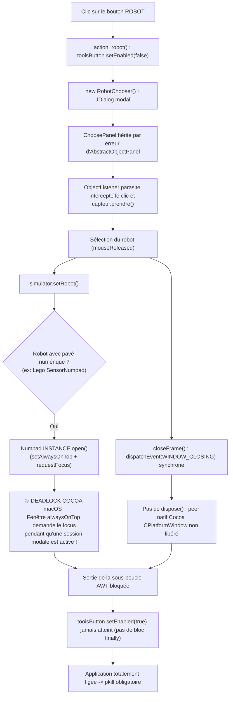

# Bilan Technique : Analyse et Résolution du Freeze sur le Bouton ROBOT & Cycle de Vie des Boîtes de Dialogue Modales

> **Date** : 14 septembre 2026  
> **Projet** : CodeLab (Client v2 Java)  
> **Auteurs** : Jérôme Lehuen + Gemini 3.8  

---

## 1. Contexte et Symptôme

Un blocage complet et très rare de CodeLab est survenu suite à un clic sur le bouton **ROBOT** (`action_robot()`) de la barre d'outils du simulateur robotique.

- **Symptôme** : L'interface utilisateur de CodeLab a freezé totalement (aucun clic de souris, aucun raccourci clavier, aucune réponse de la fenêtre principale ni des boîtes de dialogue).
- **Conséquence** : Aucun message d'erreur n'apparaissait dans le terminal ni dans les journaux, forçant l'utilisateur à tuer brutalement le processus avec `pkill`.

---

## 2. Analyse des Causes Racines

En Java Swing / AWT sous macOS, un gel absolu sans exception visible dans la console correspond à un **deadlock au niveau du gestionnaire de fenêtres natif (Cocoa WindowServer / AWT SecondaryLoop)**. L'inspection approfondie du code a révélé la conjonction de 4 mécanismes défaillants :

### Cause n°1 : Deadlock Cocoa entre dialogue modal et fenêtre `alwaysOnTop` (`Numpad`)
1. Dans [`RobotChooser.java`](file:///Users/lehuen/dev/codelab/client/src/codelab/modules/robotics/RobotChooser.java), le dialogue est modal (`super(CodeLab.FRAME, true)`).
2. Lors du relâchement du clic sur le robot sélectionné, `simulator.setRobot(robot, index)` était invoqué **avant** la fermeture de la boîte modale.
3. Si le robot dispose d'un pavé numérique (ex. robot Lego), [`Simulator.java`](file:///Users/lehuen/dev/codelab/client/src/codelab/modules/robotics/Simulator.java) appelle `Numpad.INSTANCE.open()`.
4. Or, [`Numpad`](file:///Users/lehuen/dev/codelab/client/src/codelab/controllers/widgets/Numpad.java) est un `JFrame` autonome configuré avec **`setAlwaysOnTop(true)`**, et sa méthode `open()` appelle `setVisible(true)` puis **`requestFocus()`**.
5. **Le piège Cocoa** : Sous macOS, afficher une fenêtre `setAlwaysOnTop(true)` réclamant le focus alors qu'une boîte de dialogue modale d'application (`NSModalSession`) est active désynchronise le WindowServer d'Apple. Le gestionnaire modal refuse de céder les événements, mais la fenêtre flottante de niveau supérieur intercepte la hiérarchie d'affichage. L'Event Dispatch Thread (EDT) ou la boucle native Cocoa est figée.

### Cause n°2 : Écouteurs parasites via `AbstractObjectPanel`
[`ChoosePanel`](file:///Users/lehuen/dev/codelab/client/src/codelab/modules/robotics/RobotChooser.java) héritait indûment d'[`AbstractObjectPanel`](file:///Users/lehuen/dev/codelab/client/src/codelab/modules/robotics/AbstractObjectPanel.java), qui lui associait automatiquement un [`ObjectListener`](file:///Users/lehuen/dev/codelab/client/src/codelab/modules/robotics/ObjectListener.java) (gestion du drag & drop, des poignées de rotation et de la molette pour le simulateur). Lors d'un clic sur un capteur, l'écouteur capturait le capteur (`capteur.prendre()`), déclenchait des repaints du simulateur principal en arrière-plan et exécutait deux `MouseListener` en concurrence lors du `mouseReleased`.

### Cause n°3 : Fermeture synchrone par `WINDOW_CLOSING` sans `dispose()`
[`RobotChooser.java`](file:///Users/lehuen/dev/codelab/client/src/codelab/modules/robotics/RobotChooser.java) utilisait `dispatchEvent(new WindowEvent(this, WindowEvent.WINDOW_CLOSING))`. Le composant n'avait pas de `WindowListener` et conservait la fermeture par défaut `HIDE_ON_CLOSE`. Les ressources natives Cocoa (`CPlatformWindow`) n'étaient **jamais détruites** (`dispose()` absent). L'envoi synchrone de cet événement en plein dispatch de souris natif sous macOS pouvait compromettre la sortie de la sous-boucle modale AWT (`SecondaryLoop.exit()`).

### Cause n°4 : Désactivation du bouton sans bloc `finally`
Dans [`ToolbarSim.java`](file:///Users/lehuen/dev/codelab/client/src/codelab/modules/robotics/ToolbarSim.java), `action_robot()` désactivait le bouton (`toolsButton.setEnabled(false)`) avant `new RobotChooser(...)` et le réactivait après, sans aucun bloc `try ... finally`. Si la boîte modale tardait ou rencontrait une anomalie, le bouton restait définitivement grisé.

---

## 3. Audit Exhaustif des Boîtes de Dialogue de CodeLab

Une revue complète des 11 sous-classes de `JDialog` et des usages de `JOptionPane` a été réalisée :

| Composant | Modalité | Diagnostic | Mesure appliquée |
|---|---|---|---|
| [`RobotChooser.java`](file:///Users/lehuen/dev/codelab/client/src/codelab/modules/robotics/RobotChooser.java) | Modale | **Critique** (Numpad alwaysOnTop + AbstractObjectPanel) | Refonte complète : `JPanel`, `dispose()`, action différée `invokeLater`, touche Échap. |
| [`BackgroundChooser.java` (robotique)](file:///Users/lehuen/dev/codelab/client/src/codelab/modules/robotics/BackgroundChooser.java) | Modale | Fermeture sans `dispose()`, bouton sans `finally` | Sécurisé : `dispose()`, action différée `invokeLater`, touche Échap, `try/finally`. |
| [`TurtleChooser.java` (graphique)](file:///Users/lehuen/dev/codelab/client/src/codelab/modules/graphics/TurtleChooser.java) | Modale | Fermeture synchrone sans `dispose()` | Sécurisé : `dispose()`, action différée `invokeLater`, touche Échap. |
| [`BackgroundChooser.java` (graphique)](file:///Users/lehuen/dev/codelab/client/src/codelab/modules/graphics/BackgroundChooser.java) | Modale | Fermeture synchrone sans `dispose()` | Sécurisé : `dispose()`, action différée `invokeLater`, touche Échap. |
| [`FontChooser.java`](file:///Users/lehuen/dev/codelab/client/src/codelab/utils/FontChooser.java) | Modale | Vrais boutons OK / Cancel | Aucun risque de deadlock (fermé par boutons dédiés). |
| [`NewFileDialog.java`](file:///Users/lehuen/dev/codelab/client/src/codelab/modules/editeur/manager/NewFileDialog.java) | Modale | Vrais boutons OK / Cancel / Entrée | Aucun risque de deadlock. |
| [`ReplaceDialog.java`](file:///Users/lehuen/dev/codelab/client/src/codelab/modules/editeur/text/ReplaceDialog.java) | Non-modale | Dialogue non-modal | Aucun risque (ne bloque pas l'EDT). |
| [`ChatGUI.java`](file:///Users/lehuen/dev/codelab/client/src/codelab/client/ChatGUI.java) | Non-modale | Dialogue non-modal | Aucun risque. |
| [`WaitingDialog.java`](file:///Users/lehuen/dev/codelab/client/src/codelab/utils/WaitingDialog.java) | Non-modale | Tout encapsulé dans `invokeLater` | Aucun risque. |
| [`HTMLInfoDialog.java`](file:///Users/lehuen/dev/codelab/client/src/codelab/utils/HTMLInfoDialog.java) | Modale | Affichage HTML statique | Aucun risque. |
| [`AbstractEditDialog.java`](file:///Users/lehuen/dev/codelab/client/src/codelab/modules/editeur/scratch/widgets/AbstractEditDialog.java) | Document-modale | Appelle déjà `dispose()` sur OK/Cancel | Aucun risque. |
| `JOptionPane` / `ConnectDialog` | Modale | Composants standards Swing | Aucun risque. |

---

## 4. Solutions Appliquées

### 1. Cycle de vie propre de `RobotChooser`
- `ChoosePanel` hérite désormais directement de `JPanel`.
- `setDefaultCloseOperation(DISPOSE_ON_CLOSE)`.
- Fermeture explicite : `closeFrame()` exécute `setVisible(false); dispose();`.
- **Fermeture avant action** : lors du clic de validation, la boîte de dialogue se ferme et se détruit d'abord (`closeFrame()`), puis le changement de robot (`simulator.setRobot`) et son rafraîchissement sont invoqués via `SwingUtilities.invokeLater()`.
- Prise en charge de la touche `Échap` (`KeyStroke.getKeyStroke(KeyEvent.VK_ESCAPE, 0)`).

### 2. Sécurisation défensive de `Simulator.setRobot()`
- L'appel à `Numpad.INSTANCE.open()` est encapsulé dans `SwingUtilities.invokeLater()` pour garantir qu'aucune ouverture d'une fenêtre `alwaysOnTop` ne s'exécutera de manière synchrone au cours d'une session modale.

### 3. Protection anti-blocage dans `ToolbarSim`
- Les actions `action_robot()` et `action_background()` sont sécurisées par un bloc `try ... finally { button.setEnabled(true); }`.
- Des drapeaux booléens anti-réentrance (`isChoosingRobot`, `isChoosingBackground`) empêchent toute collision d'événements lors de doubles-clics rapides.

### 4. Harmonisation des autres Choosers
- Application du même cycle de vie propre (`dispose()`, `setDefaultCloseOperation(DISPOSE_ON_CLOSE)`, action différée `invokeLater`, touche `Échap`) sur [`BackgroundChooser.java` (robotique)](file:///Users/lehuen/dev/codelab/client/src/codelab/modules/robotics/BackgroundChooser.java), [`TurtleChooser.java`](file:///Users/lehuen/dev/codelab/client/src/codelab/modules/graphics/TurtleChooser.java) et [`BackgroundChooser.java` (graphique)](file:///Users/lehuen/dev/codelab/client/src/codelab/modules/graphics/BackgroundChooser.java).

---

### 5. Sécurisation Concurrente de DataTable
- Méthodes `setSystem()` et `update()` déclarées `synchronized` pour éliminer les collisions d'accès entre le thread d'animation du simulateur (`simuthread`) et l'EDT lors d'un changement de robot.
- Itération bornée par `Math.min(system.getNbProp(), model.getRowCount())` éliminant définitivement les exceptions `ArrayIndexOutOfBoundsException: 0 >= 0`.

### 6. Libération Propre de FontChooser et NewFileDialog
- Prise en charge de la libération immédiate des ressources natives (`dispose()`) et `setDefaultCloseOperation(DISPOSE_ON_CLOSE)`.
- Raccourci de fermeture propre au clavier via la touche `Échap`.

### 7. Sécurisation de HTMLInfoDialog et ToolbarGraph
- [`HTMLInfoDialog.java`](file:///Users/lehuen/dev/codelab/client/src/codelab/utils/HTMLInfoDialog.java) : Prise en charge de `setDefaultCloseOperation(DISPOSE_ON_CLOSE)`, fermeture propre avec destruction des pairs natifs (`dispose()`), fermeture au clavier par `Échap`, et suppression du `setModal(true)` redondant.
- [`ToolbarGraph.java`](file:///Users/lehuen/dev/codelab/client/src/codelab/modules/graphics/ToolbarGraph.java) : Ajout des protections anti-réentrance (`isChoosingTurtle`, `isChoosingBackground`) et désactivation temporaire des boutons avec blocs `try ... finally { button.setEnabled(true); }`.

---

## 5. Fichiers Modifiés et Versionnés

Tous les fichiers portent désormais la mention `@author Jérôme Lehuen + Gemini 3.8` et `@version 14/09/26` :

1. [`src/codelab/modules/robotics/RobotChooser.java`](file:///Users/lehuen/dev/codelab/client/src/codelab/modules/robotics/RobotChooser.java)
2. [`src/codelab/modules/robotics/ToolbarSim.java`](file:///Users/lehuen/dev/codelab/client/src/codelab/modules/robotics/ToolbarSim.java)
3. [`src/codelab/modules/robotics/Simulator.java`](file:///Users/lehuen/dev/codelab/client/src/codelab/modules/robotics/Simulator.java)
4. [`src/codelab/modules/robotics/BackgroundChooser.java`](file:///Users/lehuen/dev/codelab/client/src/codelab/modules/robotics/BackgroundChooser.java)
5. [`src/codelab/modules/graphics/TurtleChooser.java`](file:///Users/lehuen/dev/codelab/client/src/codelab/modules/graphics/TurtleChooser.java)
6. [`src/codelab/modules/graphics/BackgroundChooser.java`](file:///Users/lehuen/dev/codelab/client/src/codelab/modules/graphics/BackgroundChooser.java)
7. [`src/codelab/modules/graphics/ToolbarGraph.java`](file:///Users/lehuen/dev/codelab/client/src/codelab/modules/graphics/ToolbarGraph.java)
8. [`src/codelab/DataTable.java`](file:///Users/lehuen/dev/codelab/client/src/codelab/DataTable.java)
9. [`src/codelab/utils/FontChooser.java`](file:///Users/lehuen/dev/codelab/client/src/codelab/utils/FontChooser.java)
10. [`src/codelab/utils/HTMLInfoDialog.java`](file:///Users/lehuen/dev/codelab/client/src/codelab/utils/HTMLInfoDialog.java)
11. [`src/codelab/modules/editeur/manager/NewFileDialog.java`](file:///Users/lehuen/dev/codelab/client/src/codelab/modules/editeur/manager/NewFileDialog.java)
12. [`src/codelab/client/CodelabClient.java`](file:///Users/lehuen/dev/codelab/client/src/codelab/client/CodelabClient.java)
13. [`src/codelab/client/CommandHandler.java`](file:///Users/lehuen/dev/codelab/client/src/codelab/client/CommandHandler.java)
14. [`src/codelab/client/AbstractServerFacade.java`](file:///Users/lehuen/dev/codelab/client/src/codelab/client/AbstractServerFacade.java)

15. [`src/codelab/helper/AbstractSimulator.java`](file:///Users/lehuen/dev/codelab/client/src/codelab/helper/AbstractSimulator.java)
16. [`src/codelab/utils/audio/MiniSynth.java`](file:///Users/lehuen/dev/codelab/client/src/codelab/utils/audio/MiniSynth.java)
17. [`src/codelab/CodeLab.java`](file:///Users/lehuen/dev/codelab/client/src/codelab/CodeLab.java)
18. [`src/codelab/utils/SwingWatchdog.java`](file:///Users/lehuen/dev/codelab/client/src/codelab/utils/SwingWatchdog.java)

---

## 6. Analyse et Résolution Complémentaire : Deadlock du Bouton "Arrêter", Freeze Audio JSyn et Diagnostic Persistant (`freeze.log`)

### 1. Deadlock lors du clic sur "Arrêter" (EDT vs Thread de Simulation)
- **Cause Racine** : Lors du clic sur le bouton Arrêter, [`AbstractToolbar.action_stop()`](file:///Users/lehuen/dev/codelab/client/src/codelab/AbstractToolbar.java#L393) invoquait `module.stop()` directement sur l'Event Dispatch Thread (EDT). Cette méthode appelait [`Simulator.stop()`](file:///Users/lehuen/dev/codelab/client/src/codelab/modules/robotics/Simulator.java#L383) et [`AbstractSimulator.stop()`](file:///Users/lehuen/dev/codelab/client/src/codelab/helper/AbstractSimulator.java#L47), qui exécutaient un `simuthread.join()` non borné.
- Pendant que l'EDT était bloqué en attente de la mort du thread de simulation, ce dernier tentait d'effectuer un rafraîchissement d'interface Swing (`dataTable.update()` / `setValueAt()`, `adjustScrollBars()` / `setValue()`, ou `TOOLKIT.sync()`), réclamant le verrou global `AWT TreeLock` détenu par l'EDT : interblocage mutuel immédiat et permanent.
- **Correction** : Dans [`Simulator.java`](file:///Users/lehuen/dev/codelab/client/src/codelab/modules/robotics/Simulator.java) et [`AbstractSimulator.java`](file:///Users/lehuen/dev/codelab/client/src/codelab/helper/AbstractSimulator.java), `simuthread.join()` a été remplacé par une interruption explicite `t.interrupt()` suivie d'une jointure bornée défensive `t.join(200)`. L'EDT ne peut plus jamais être suspendu indéfiniment.

### 2. Freeze après `playTone` / Lecture Audio (JSyn & macOS CoreAudio)
- **Cause Racine** : [`CodeLab.stopaudio()`](file:///Users/lehuen/dev/codelab/client/src/codelab/CodeLab.java#L369) invoquait `MiniSynth.reset(SYNTH_OSC)` à chaque arrêt de son ou fin d'exécution. Cette méthode détruisait et recréait une instance complète de `MiniSynth`, sans libération bas niveau du périphérique audio hôte. Sous macOS, des instanciations et démarrages répétés du synthétiseur (`synth.start()`) saturaient les unités natives CoreAudio du système d'exploitation, aboutissant à un gel total dans la pile native AWT/CoreAudio.
- **Correction** : Dans [`CodeLab.java`](file:///Users/lehuen/dev/codelab/client/src/codelab/CodeLab.java), suppression de l'appel destructif `MiniSynth.reset()`. Dans [`MiniSynth.java`](file:///Users/lehuen/dev/codelab/client/src/codelab/utils/audio/MiniSynth.java), la coupure audio est assurée en douceur par `osc.noteOff()` et l'interruption de la veille, en maintenant le flux de sortie `lineOut` et le moteur audio actifs pour les sons futurs.

### 3. Concurrence `Executeur` / EDT Swing
- **Cause Racine** : En fin d'exécution d'un programme utilisateur, `Executeur.run()` invoquait [`CodeLab.executionCompleted()`](file:///Users/lehuen/dev/codelab/client/src/codelab/CodeLab.java#L342) depuis le thread worker d'arrière-plan. Cette méthode manipulait directement l'état de composants Swing (`enableTabbedPane`, `tabbedpane.requestFocus`, `consolidate`, `updateFrameTitle`, `checkErrorExe`).
- **Correction** : L'ensemble de ces mutations est désormais confiné dans `SwingUtilities.invokeLater(...)`.

### 4. Diagnostic Exhaustif et Journal Persistant (`~/codelab.files/freeze.log`)
- Pour répondre au besoin *"Pas moyen de savoir pourquoi CodeLab a freezé"*, [`SwingWatchdog.java`](file:///Users/lehuen/dev/codelab/client/src/codelab/utils/SwingWatchdog.java) a été intégralement renforcé :
  - Fréquence de heartbeat portée à 1s, seuil de détection à 4s.
  - Interrogation directe de `ThreadMXBean.findDeadlockedThreads()` pour détecter et identifier les interblocages de moniteurs Java (thread demandeur, verrou en attente, thread détenteur).
  - Dump complet de l'ensemble des threads de la JVM (`dumpAllThreads(true, true)`) avec leurs états, verrous et piles d'appels intégrales.
  - Écriture persistante immédiate dans le fichier `~/codelab.files/freeze.log` (en plus de `codelab.log` et `System.err`), consultable même après un arrêt forcé par `pkill`.

---

Compilation finale validée par `./build.sh` : **`BUILD SUCCESSFUL`** (version `1.3.2`, build `2609141516`).

