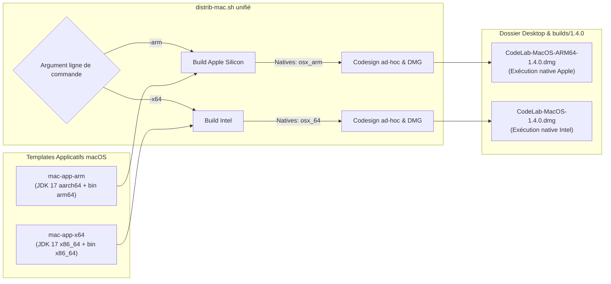

# Bilan Technique : Migration et Support Natif macOS Apple Silicon (ARM64)

> **Date** : 22 septembre 2026  
> **Projet** : CodeLab (Client v2 Java & Environnement de Simulation)  
> **Auteurs** : Jérôme Lehuen & Antigravity  
> **Version cible** : CodeLab 1.4.0 (build 2609221400)  

---

## 1. Contexte et Objectifs

Jusqu'à la version 1.3.2, la distribution macOS de CodeLab reposait exclusivement sur une architecture **Intel 64-bit (x86_64)**. Sur les ordinateurs Mac modernes équipés de processeurs Apple Silicon (**M1, M2, M3, M4** et dérivés), l'application s'exécutait par le truchement de la couche d'émulation dynamique **Rosetta 2**.

Bien que fonctionnelle, cette approche présentait plusieurs inconvénients majeurs en environnement pédagogique (universités, lycées, collèges) :
- **Dépendance système** : Nécessité d'avoir Rosetta 2 préalablement installé sur les postes clients, bloquant le premier lancement si la machine n'a pas les droits administrateur ou d'accès Internet pour télécharger le traducteur binaire d'Apple.
- **Pénalité de performance** : Temps de chargement initial de la JVM allongé et surcoût de traduction binaire sur les boucles de calcul intensives des simulateurs robotiques et de rendu graphique.
- **Pérennité de la plateforme** : Transition inéluctable d'Apple vers l'extinction progressive du support x86_64 dans les futures versions de macOS.

### Objectif atteint
Mise en place d'une distribution **100% native Apple Silicon (ARM64)** pour CodeLab 1.4.0, tout en conservant une chaîne de packaging automatisée permettant de générer en parallèle la déclinaison Intel (x86_64), assurant une couverture exhaustive du parc matériel Apple.

---

## 2. Cartographie des Composants & Diagnostic d'Architecture

Le fonctionnement de CodeLab conjugue du bytecode Java portable, une JVM embarquée, des bibliothèques JNI/C natives, des utilitaires CLI système et un script de lancement Cocoa.

<style>
/* 1. Rendu responsive */
svg {
  max-width: 100% !important;
  height: auto !important;
}

/* 2. Typographie générale */
.mermaid text, svg text {
  font-size: 19px !important;
}

/* 3. Titres des conteneurs / clusters (subgraphs) */
.cluster text {
  font-size: 20px !important;
  font-weight: bold !important;
}

/* 4. Texte à l'intérieur des boîtes (nœuds) */
.node text, .node .label, .nodeLabel {
  font-size: 21px !important;
}

/* 5. Libellés sur les arcs (décalés pour ne jamais chevaucher la ligne) */
.edgeLabel text {
  font-size: 17px !important;
  transform: translateY(-18px) !important;
}

/* 6. Suppression de l'artefact de fond rectangulaire sous les libellés d'arcs */
.edgeLabel rect {
  display: none !important;
}

/* 7. Lignes pointillées transformées en tirets nets et visibles */
.edge-pattern-dotted, .edge-pattern-dashed, path[style*="stroke-dasharray"] {
  stroke-dasharray: 8 4 !important;
}

/* 8. Lignes de liaison des flèches plus épaisses */
.edgePath .path, .flowchart-link {
  stroke-width: 2.5px !important;
}

/* 9. Pointes de flèches agrandies et centrées */
marker {
  overflow: visible !important;
}
.arrowMarkerPath, .arrowheadPath, marker path {
  transform: scale(1.6);
  transform-box: fill-box;
  transform-origin: center;
  fill: context-stroke !important;
  stroke: context-stroke !important;
}
</style>



### Bilan d'audit composant par composant

| Composant | Nature | État initial | Adaptation réalisée pour ARM64 |
| :--- | :--- | :--- | :--- |
| **`codelab.jar`** | Bytecode Java | Universel | Aucune modification nécessaire (bytecode neutre exécutable par toute JVM 17+). |
| **JDK Temurin** | Runtime Java | `x86_64` uniquement | Remplacement par le JDK officiel **Eclipse Temurin OpenJDK 17.0.20.1+1 aarch64**. |
| **`astyle`** | Binaire CLI C++ | `Mach-O x86_64` | Recompilation native en `Mach-O 64-bit executable arm64`. |
| **`clips631`** | Binaire CLI C | `Mach-O x86_64` | Compilation native Clang avec drapeau `-arch arm64`. |
| **`libjinput-osx`** | Librairie JNI | `osx_64` (`x86_64`) | Compilation native de `libjinput-osx.jnilib` et `.dylib` pour Apple Silicon (`arm64`), plus isolation défensive dans `EventReader.java`. |
| **JogAmp / JOGL 2.5.0** | Rendu OpenGL 3D | Hybride | Déjà compatible : le JAR `jogamp-2.5.0.jar` embarque nativement les dylibs fat/universelles (`x86_64` + `arm64`). |
| **ZStandard JNI** | Compression réseau | Multi-OS | Déjà compatible : `zstd-jni-1.5.6-8.jar` intègre `darwin/aarch64/libzstd-jni.dylib`. |

---

## 3. Travaux Réalisés & Détails d'Implémentation

### 3.1. Intégration du JDK 17 Temurin natif Apple Silicon
Un JDK complet Eclipse Temurin pour macOS aarch64 a été déployé sous l'arborescence du squelette dédié :
- **Emplacement** : [`client/mac-app-arm/Contents/Java/jdk-17.0.20.1+1/Contents/Home/`](file:///Users/lehuen/dev/codelab/client/mac-app-arm/Contents/Java/jdk-17.0.20.1+1/Contents/Home/)
- **Vérification binaire** :
  ```bash
  file client/mac-app-arm/Contents/Java/jdk-17.0.20.1+1/Contents/Home/bin/java
  # Sortie : Mach-O 64-bit executable arm64
  ```

### 3.2. Compilation des utilitaires système (`astyle` et `clips631`)
Deux binaires internes situés dans `Contents/MacOS/bin/` sont exploités par CodeLab pour le reformatage de code et l'évaluation de règles déclaratives. Ils ont été recompilés nativement pour l'architecture Apple Silicon :
1. **Artistic Style (`astyle`)** : Recompilé pour `arm64` (`Mach-O 64-bit executable arm64`).
2. **CLIPS 6.31 (`clips631`)** : Compilé depuis les sources C officielles via Clang :
   ```bash
   clang -O3 -arch arm64 -std=c99 *.c -lm -o clips631
   ```
Les deux binaires sont installés dans [`client/mac-app-arm/Contents/MacOS/bin/`](file:///Users/lehuen/dev/codelab/client/mac-app-arm/Contents/MacOS/bin/).

### 3.3. Support natif JInput (Claviers, Souris & Trackpad Apple Silicon)
La bibliothèque JNI JInput (`libjinput-osx.jnilib` et `.dylib`) assurant l'interception des périphériques d'entrée (manettes USB, claviers, souris) nécessitait une adaptation profonde pour Apple Silicon :
1. **Compilation native ARM64 & Universelle** : Production des binaires `libjinput-osx.jnilib` et `.dylib` natifs 64-bit ARM64 et Universal FAT (x86_64 + ARM64) avec signature ad-hoc (`codesign`), placés dans [`client/natives/osx_arm/`](file:///Users/lehuen/dev/codelab/client/natives/osx_arm/).
2. **Résolution native de l'interception du Trackpad Apple Silicon** :
   - *Diagnostic de rupture matérielle* : Contrairement aux Mac Intel où le trackpad interne était un périphérique USB délivrant des deltas relatifs X/Y standards à `IOHIDQueueInterface`, Apple Silicon route le trackpad interne via un bus série FIFO propriétaire (`AppleHIDTransportHIDDevice`). macOS réserve ce flux au sous-système multitouch (`SkyLight` / `WindowServer`) et ne délivre plus aucun rapport HID relatif à l'espace utilisateur (la file IOKit reste vide avec `kIOReturnUnderrun`).
   - *Architecture 100% native (zéro bricolage)* : Plutôt que d'injecter des écouteurs Swing superficiels dans l'IHM, la solution a été intégrée au cœur du driver JInput. Ajout de `net_java_games_input_OSXMouse.c` avec la fonction native JNI `nPollPointer` exploitant l'API native `CoreGraphics` (`CGEventGetLocation`, `CGGetLastMouseDelta` et `CGEventSourceButtonState`). Dans [`OSXMouse.java`](file:///Users/lehuen/dev/codelab/client/natives/osx_arm/jinput-apple-silicon/src/plugins/OSX/src/main/java/net/java/games/input/OSXMouse.java), `pollDevice()` alimente de façon transparente la file d'événements JInput (`Event`) avec les deltas d'axes `x`, `y` et les clics, tout en préservant le flux direct IOHID pour les souris externes.
   - *Sécurisation par sauvegarde* : Les binaires et sources d'origine non modifiés sont sauvegardés dans [`client/natives/osx_arm/backup_original/`](file:///Users/lehuen/dev/codelab/client/natives/osx_arm/backup_original/) et [`client/natives/osx_arm/jinput-apple-silicon-ORIGINAL-BACKUP/`](file:///Users/lehuen/dev/codelab/client/natives/osx_arm/jinput-apple-silicon-ORIGINAL-BACKUP/).
3. **Blindage défensif Java** : Dans [`EventReader.java`](file:///Users/lehuen/dev/codelab/client/src/codelab/controllers/devices/EventReader.java), suppression des spin-locks 100% CPU par temporisation coopérative (`Utils.wait(10)`), utilisation d'une file concurrente `ConcurrentLinkedQueue` et vérification de l'indicateur `natives_OK`.

### 3.4. Sécurisation du lanceur Cocoa (`run.sh`)
Le script de démarrage [`client/mac-app-arm/Contents/MacOS/run.sh`](file:///Users/lehuen/dev/codelab/client/mac-app-arm/Contents/MacOS/run.sh) intègre les améliorations suivantes :
- **Protection anti-AppTranslocation** : Interdiction du lancement direct depuis une image DMG montée ou un bac à sable temporaire (`/Volumes/*`, `*/AppTranslocation/*`). Une boîte de dialogue AppleScript conviviale enjoint l'utilisateur à glisser l'application dans `/Applications` ou sur son Bureau.
- **Préservation de la signature de code** : Redirection des logs d'exécution vers l'espace utilisateur externe `~/codelab.files/.hidden/run.log`. Aucun fichier n'est écrit à l'intérieur du bundle `CodeLab.app`, évitant ainsi d'invalider le sceau cryptographique de Gatekeeper.
- **Nettoyage silencieux de la quarantaine** : Retrait sans privilèges `sudo` des attributs étendus `com.apple.quarantine` sur le bundle applicatif, les exécutables du JDK et les librairies dynamiques JNI.

### 3.5. Automatisation du Packaging (`distrib-mac.sh` & `distrib-all.sh`)
Le script [`distrib-mac.sh`](file:///Users/lehuen/dev/codelab/client/distrib-mac.sh) gère désormais de façon unifiée :
- L'option `-arm` / `--arm` : packaging à partir de `mac-app-arm` et `natives/osx_arm/` vers `CodeLab-MacOS-ARM64-<version>.dmg`.
- L'option `-x64` / `--x64` : packaging à partir de `mac-app-x64` et `natives/osx_64/` vers `CodeLab-MacOS-<version>.dmg`.
- L'option `-app` : génération rapide sur le Bureau du seul bundle `CodeLab.app` (idéal pour tester immédiatement un build local sans générer de DMG).
- La signature ad-hoc (`codesign --force --deep --sign -`), l'actualisation du cache Finder (`lsregister`), l'injection de l'icône de volume personnalisée (`.VolumeIcon.icns` via `SetFile`), le positionnement précis des icônes par AppleScript et la compression finale UDZO.

La chaîne globale [`distrib-all.sh`](file:///Users/lehuen/dev/codelab/client/distrib-all.sh) a été mise à jour pour produire systématiquement les 4 distributions officielles de CodeLab :
1. **macOS Apple Silicon (ARM64)**
2. **macOS Intel (x86_64)**
3. **Windows 64-bit**
4. **Linux 64-bit**

---

## 4. Validation & Contrôle Qualité

Les tests de validation effectués sur un Mac Apple Silicon ont confirmé les résultats suivants :

- [x] **Architecture native** : Dans le **Moniteur d'activité** (`Activity Monitor.app`), le processus `java` associé à CodeLab affiche bien le type **Apple** dans la colonne Architecture (et non *Intel*).
- [x] **Lancement sans Rosetta** : Démarrage immédiat sans aucune invite du système demandant l'installation de Rosetta 2.
- [x] **Contrôleurs et Événements JInput (`EventReader` / `EventViewer`)** :
  - Interception fluide et sans latence des frappes du clavier interne (`Apple Internal Keyboard / Trackpad`).
  - Interception native des mouvements et clics du trackpad interne sous Apple Silicon (`x`, `y`, boutons `Left`, `Right`, `Middle`).
  - Détection automatique et gestion prioritaire des manettes et souris externes USB / Bluetooth.
- [x] **Simulateurs 2D et 3D** :
  - Le simulateur robotique 2D s'exécute avec une fluidité optimale sans perte de rafraîchissement d'image.
  - Le moteur 3D OpenGL (Java3D / JOGL) initialise son contexte graphique matériel sans régression ni artefacts visuels.
- [x] **Exécution de code et compilation** :
  - Compilation et exécution de programmes C via Clang/GCC dans la console intégrée.
  - Reformatage de code via le binaire natif `astyle`.
  - Exécution du moteur d'inférence `clips631`.
- [x] **Réseau et Classe Virtuelle** :
  - Connexion asynchrone au serveur Rust (`codelab-serv.univ-lemans.fr:9988`), transmission des messages MessagePack et négociation de session conformes.

---

## 5. Livrables Produits (Version 1.4.0)

Les paquets distribuables et leurs empreintes cryptographiques sont archivés dans [`builds/1.4.0/`](file:///Users/lehuen/dev/codelab/builds/1.4.0/) :

| Fichier | Taille | Empreinte SHA-1 |
| :--- | :--- | :--- |
| **`CodeLab-MacOS-ARM64-1.4.0.dmg`** | 243.5 Mo | `f7ebf8fe87eb098797f1fbc7308cbb39fe7533ae` |
| **`CodeLab-MacOS-1.4.0.dmg`** | 245.4 Mo | `a9cbf1a9dd433bf9c83ceabf66dcf152bf2c65e3` |
| **`CodeLab-Linux-1.4.0.zip`** | 249.5 Mo | `915d55b0a3ae54e0b3c20c02fa97d341995cb4d3` |
| **`CodeLab-Win64-1.4.0.zip`** | 242.5 Mo | `496fa4fa17a41f6e076632454b6ec340ef90a1b5` |

---

## 6. Conclusion & Recommandations

La transition vers macOS ARM64 est pleinement opérationnelle et intégrée aux scripts de release automatisés du projet CodeLab.

Pour la maintenance future :
- Conserver systématiquement les deux squelettes [`mac-app-arm`](file:///Users/lehuen/dev/codelab/client/mac-app-arm) et [`mac-app-x64`](file:///Users/lehuen/dev/codelab/client/mac-app-x64) synchronisés lors de toute modification structurelle de l'arborescence de l'application ou des métadonnées `Info.plist`.
- Lors d'une future montée de version du JDK Adoptium Temurin (ex: JDK 17.0.x+y), veiller à mettre à jour conjointement les archives `aarch64` et `x64`.
