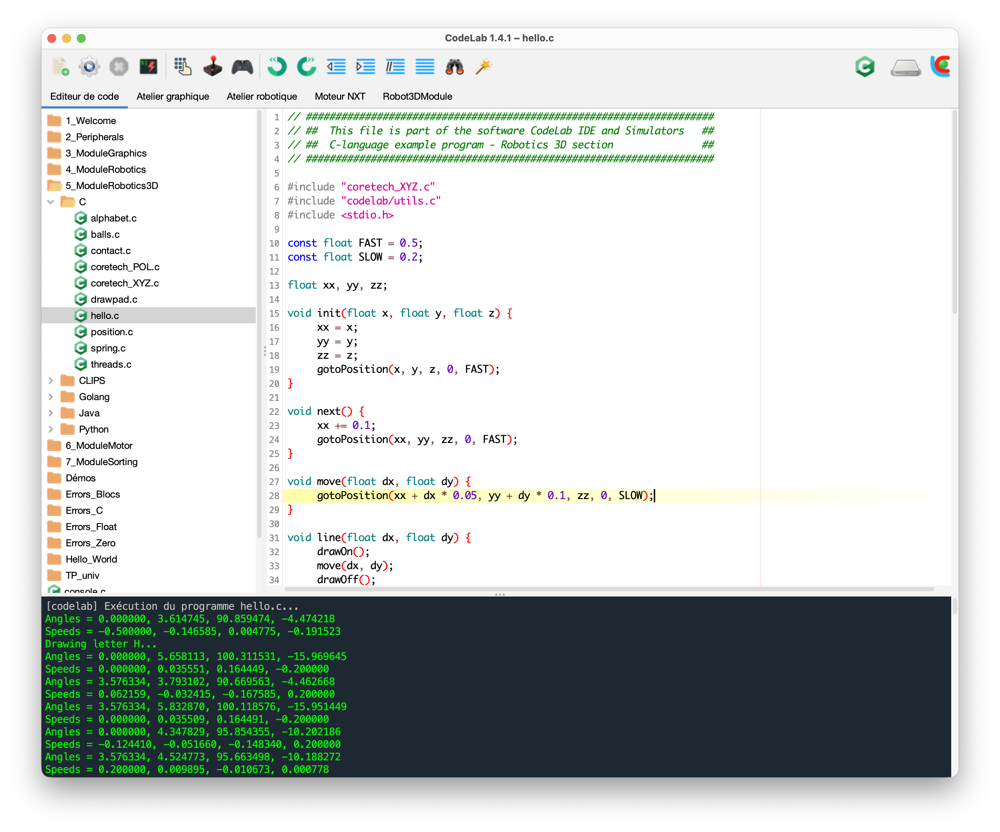
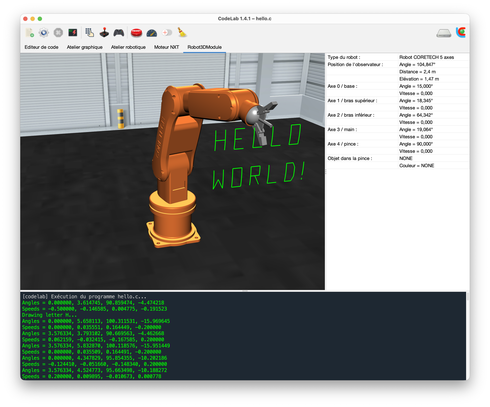

<p align="center">
  
</p>

<h1 align="center">CodeLab IDE & Simulators</h1>

<p align="center">
  <a href="https://github.com/jlehuen/CodeLab/releases/latest"></a>
  <a href="LICENSE"></a>
  <a href="https://adoptium.net/"></a>
  <a href="https://www.rust-lang.org/"></a>
  <a href="https://www.app.asso.fr/"></a>
</p>

<p align="center">
  <strong>Environnement d'Apprentissage de la Programmation
  <br>pour l'Enseignement Secondaire et Supérieur</strong>
  <br>
  <br>Site officiel : <a href="https://codelab.univ-lemans.fr">https://codelab.univ-lemans.fr</a>
</p>

**CodeLab** est un environnement pédagogique dédié à l'apprentissage de la programmation en collège, lycée et premières années d'études supérieures. Son originalité est qu'il propose des alternatives ludiques ou techniques aux traditionnelles interactions écran-clavier pour la conception des activités pédagogiques, au travers de l'utilisation de "modules applicatifs". Ces modules, disponibles sous la forme de plugins, peuvent être des **visualisations**, des **panneaux de contrôle**, des **simulateurs**, et autres systèmes temps-réel. Chaque module est l'association d'une **IHM** (Interface Homme-Machine) et d'une interface de programmation applicative (souvent désignée par le terme **API** pour Application Programming Interface), disponible pour chacun des langages supportés par CodeLab. Les apprenants peuvent ainsi se focaliser sur les aspects algorithmiques et sur le codage, tout en travaillant sur des applications qui possèdent des caractéristiques riches et motivantes.

CodeLab supporte un large spectre de paradigmes de programmation (impératif, fonctionnel, objet, déclaratif) et ce afin de répondre aux recommandations du programme de la spécialité NSI (Numérique et Sciences Informatiques) de première et de terminale. En plus des langages traditionnels, CodeLab intègre un langage "par assemblage de blocs" qui permet de découvrir les structures de programmation en s'abstrayant d'une syntaxe spécifique.

Une fonctionnalité de CodeLab est de permettre la constitution de **classes virtuelles** (en présence ou à distance) grâce à une architecture client-serveur dédiée. Le modèle utilisateur / groupe / session permet la constitution de groupes de TP à géométrie variable, encadrés par un ou plusieurs tuteurs. Ces derniers peuvent **suivre en temps réel** le travail des apprenants, tester leurs programmes, communiquer avec eux par l’intermédiaire d’une messagerie instantanée intégrée, les déconnecter en fin de séance, etc.

<p align="center">
  
  
</p>

<p align="center">
  <br>
  
</p>

## Téléchargements (Version 1.4.2)

Les paquets d'installation autonomes prêts à l'emploi (embarquant leur propre environnement d'exécution, sans configuration préalable) sont téléchargeables dans les [Releases officielles](https://github.com/jlehuen/CodeLab/releases/latest) :

| Plateforme | Paquet d'installation | Architecture cible |
| :--- | :--- | :--- |
|  **macOS** | [`CodeLab-MacOS-Silicon-1.4.2.dmg`](https://github.com/jlehuen/CodeLab/releases/latest) | Apple Silicon (M1, M2, M3, M4) |
|  **macOS** | [`CodeLab-MacOS-Intel-1.4.2.dmg`](https://github.com/jlehuen/CodeLab/releases/latest) | Intel 64 bits (x86_64) |
|  **Windows** | [`CodeLab-Win64-1.4.2-Setup.exe`](https://github.com/jlehuen/CodeLab/releases/latest) | Windows 10 / 11 (64 bits) |
|  **Linux** | [`CodeLab-Linux-1.4.2.zip`](https://github.com/jlehuen/CodeLab/releases/latest) | Linux (x86_64) |

<p align="center">
  <br>
  
</p>

## Architecture du Répertoire

```text
codelab/
├── client/                     # Application cliente Java
│   ├── src/                    # Sources Java (package codelab)
│   │   ├── client/             # Protocole réseau client-serveur (MessagePack)
│   │   ├── controllers/        # Gestion des périphériques (JInput, joysticks, etc.)
│   │   ├── modules/            # Modules interactifs et simulateurs PAC
│   │   └── utils/              # Cryptographie, parseurs, compression Tar/Zstd
│   ├── data/                   # Ressources graphiques, sons, syntaxes de langages
│   ├── hidden/codelab/         # Bibliothèques tierces (FlatLaf, JInput, etc.)
│   ├── natives/                # Bibliothèques natives C/C++ par OS (.dylib, .so, .dll)
│   ├── build.xml               # Fichier de build Apache Ant
│   ├── build.sh                # Script de compilation local
│   └── distrib-*.sh            # Scripts de packaging (macOS, Linux, Windows)
│
├── server/                     # Serveur d'infrastructure
│   ├── server/                 # Serveur asynchrone Rust (Tokio)
│   │   ├── src/                # Code source Rust (main, database, network, admin)
│   │   ├── config/             # Gabarits de configuration (server.properties, sessions.xml)
│   │   └── Cargo.toml          # Dépendances et métadonnées Cargo
│   ├── run-server.sh           # Script de démarrage du service
│   └── kill-server.sh          # Script d'arrêt propre du service
│
├── VERSION                     # Source unique du numéro de version
├── .gitignore
├── .gitattributes
├── .editorconfig
├── LICENSE
└── README.md
```

<p align="center">
  <br>
  
</p>

## Compilation & Démarrage Rapide

### 1. Client Java

#### Prérequis pour la compilation
- **Java Development Kit (JDK) 17 LTS** installé et configuré (`JAVA_HOME`)
- **Apache Ant 1.10+** (ou utilisation de l'exécutable Ant présent dans `client/java/`)

#### Compilation
```bash
cd client
./build.sh
```
Le binaire résultant est généré dans `client/hidden/codelab/codelab.jar`. Vous pouvez le tester directement avec votre JVM locale :
```bash
java -jar hidden/codelab/codelab.jar
```

#### Génération des distributions autonomes (Packaging clé en main)

> [!NOTE]
> **Pourquoi les runtimes JDK ne sont-ils pas inclus dans le dépôt Git ?**  
> Les environnements d'exécution Java complets dépassent la limite de taille par fichier imposée par GitHub (fichiers internes `lib/modules` > 100 Mo) et alourdiraient le dépôt de plus de 1,5 Go. Ils sont donc volontairement exclus via `.gitignore`.

Pour construire les distributions autonomes prêtes à l'emploi (embarquant leur propre JVM sans dépendance pour l'utilisateur final), téléchargez au préalable les archives **JDK 17 LTS** officielles sur [Adoptium Temurin Releases](https://adoptium.net/fr/temurin/releases/?version=17) et décompressez-les dans les dossiers correspondants :

| Plateforme cible | Archive officielle Adoptium Temurin 17 | Format | Dossier cible dans `client/` |
| :--- | :--- | :--- | :--- |
|  **macOS Apple Silicon** | [macOS aarch64 (JDK 17)](https://adoptium.net/fr/temurin/releases/?version=17&os=mac&arch=aarch64&package=jdk) | `.tar.gz` | `mac-app-arm/Contents/Java/jdk-17.0.20.1+1/` |
|  **macOS Intel** | [macOS x64 (JDK 17)](https://adoptium.net/fr/temurin/releases/?version=17&os=mac&arch=x64&package=jdk) | `.tar.gz` | `mac-app-x64/Contents/Java/jdk-17.0.8.1+1/` |
|  **Windows 64 bits** | [Windows x64 (JDK 17)](https://adoptium.net/fr/temurin/releases/?version=17&os=windows&arch=x64&package=jdk) | `.zip` | `java/windows_64/JDK-17.0.8.1+1/` |
|  **Linux 64 bits** | [Linux x64 (JDK 17)](https://adoptium.net/fr/temurin/releases/?version=17&os=linux&arch=x64&package=jdk) | `.tar.gz` | `java/linux_64/JDK-17.0.8.1+1/` |

> [!TIP]
> Si vous téléchargez une mise à jour mineure plus récente de Temurin 17 (ex: `jdk-17.0.14+7`), renommez simplement le dossier extrait avec le nom attendu dans le tableau ci-dessus (ou créez un lien symbolique) afin que les lanceurs et scripts de packaging le détectent automatiquement.

Une fois les JDK placés, lancez le script correspondant à votre cible :
- **macOS** (DMG universel Apple Silicon & Intel) : `./distrib-mac.sh`
- **Linux** (archive autonome FreeDesktop) : `./distrib-linux.sh`
- **Windows** (Installateur NSIS) : `./distrib-win64-nsis.sh`

### 2. Serveur Asynchrone Rust

Le serveur CodeLab orchestre les classes virtuelles, gère les flux bidirectionnels entre apprenants et enseignants et fournit un tableau de bord web de supervision.

#### Architecture & Caractéristiques Techniques
- **Modèle Acteur Asynchrone (Tokio)** : Conçu pour absorber simultanément des centaines de sessions à très faible empreinte mémoire, avec arrêt gracieux (*graceful shutdown*).
- **Protocole Binaire Optimisé** : Échanges réseau compacts et rapides sérialisés au format **MessagePack** sur socket TCP.
- **Tableau de Bord d'Administration Web** : Interface intégrée accessible par navigateur (HTTP Basic) permettant le suivi en temps réel des apprenants connectés, l'inspection des groupes et la déconnexion à distance.
- **Persistance & Sécurité** : Définition déclarative des sessions, tuteurs et élèves en XML (`sessions.xml`), et stockage isolé des espaces de travail étudiants sur le système de fichiers.
- **Sauvegardes Automatiques** : Système de rotation de backups horodatés avec compression haute performance **TAR + Zstandard** (`.tar.zst`).

#### Prérequis
- Toolchain [Rust & Cargo](https://rustup.rs/) (édition 2021 stable)

#### Configuration Initiale
Créez vos fichiers de configuration locaux à partir des gabarits d'exemple fournis :
```bash
cd server/server
cp config/server.properties.example config/server.properties
cp config/sessions.example.xml config/sessions.xml
```

*Remarque : Par sécurité et conformité RGPD, les fichiers réels `server.properties` et `sessions.xml` sont strictement ignorés par Git.*

#### Démarrage du Serveur

##### Mode Développement
```bash
cd server/server
cargo run
```

##### Mode Production (Binaire optimisé)
```bash
cd server/server
cargo build --release
./target/release/server
```

Le serveur écoute sur les adresses configurées dans `server.properties` :
- **Port TCP (ex: 9988 ou 7878)** : Connexions réseau des clients élèves et enseignants.
- **Port HTTP (ex: 9989)** : Interface web d'administration (`http://127.0.0.1:9989`). Les identifiants sont définis dans `server.properties` (identifiant `admin` et empreinte SHA-256 du mot de passe).

Des scripts de service sont également disponibles dans le dossier `server/` :
- `./run-server.sh` : Démarrage du serveur en arrière-plan.
- `./kill-server.sh` : Arrêt propre du processus serveur.

<p align="center">
  <br>
  
</p>

## Sécurité & Protection des Données

- **Confidentialité** : Les données nominatives étudiantes, listes de promotions, traces d'exécution et identifiants SMTP de production sont systématiquement isolés et exclus du dépôt public.
- **Authentification** : Mots de passe chiffrés par empreinte SHA-256 (compatible avec le format standard `echo -n "votre_mdp" | sha256sum | xxd -r -p | base64`).
- **Résilience** : Le serveur intègre un mode de repli automatique sur ses gabarits d'exemple si les configurations personnalisées ne sont pas présentes au démarrage.

<p align="center">
  <br>
  
</p>

## Licence & Propriété Intellectuelle
 
- **Auteur** : Jérôme Lehuen, Maître de Conférences à [Le Mans Université](https://www.univ-lemans.fr).
- **Dépôt légal** : Le logiciel *CodeLab IDE & Simulators* est enregistré auprès de l'[Agence pour la Protection des Programmes (APP)](https://www.app.asso.fr/) sous le numéro :

<p align="center">
  
  <br/>IDDN-FR-001-260031-000-SC-2022-000-10000
</p>

- **Licence & Conditions d'utilisation** : Ce logiciel (code source et binaires) est mis à disposition gratuitement à des fins éducatives, académiques et de recherche non commerciale. **Toute utilisation ou exploitation commerciale, revente ou sous-licence est strictement interdite** sans accord préalable écrit de l'auteur et de Le Mans Université. Consultez le fichier [LICENSE](LICENSE) pour l'intégralité des termes et des mentions légales.
- **Documentation** : La documentation, les guides et les programmes d'exemples sont mis à disposition sous licence [Creative Commons CC-BY-NC-ND](https://creativecommons.org/licenses/by-nc-nd/4.0/)
- **Copyright** : © 2021-2026 Jérôme Lehuen, Le Mans Université.

