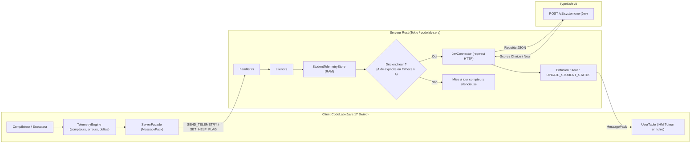

# Roadmap : Intégration Télémétrie Pédagogique & IA "System One" (TypeSafe Jev) dans CodeLab

> **Guide d'exécution pour l'assistant Antigravity (`agy`) avec le modèle Gemini 3.8**  
> Ce document est conçu comme une spécification directe et un plan de travail autonome (Spec-Driven Development) pour implémenter la télémétrie pédagogique et la qualification intelligente des blocages étudiants dans CodeLab.

---

## 1. Contexte & Vision

CodeLab est un environnement d'apprentissage de la programmation (collège, lycée NSI, licence L1/L2) fondé sur les théories de Seymour Papert et Jean Piaget (apprentissage actif, simulateurs interactifs, absence de magie noire).

### Le Problème à Résoudre
En séance de TP supervisée (sur le serveur Rust `codelab-serv.univ-lemans.fr`), le tuteur a sous les yeux une table d'utilisateurs (`UserTable`) où les étudiants peuvent uniquement activer un drapeau binaire `helpFlag` (« Lever la main »).
- **Files d'attente aveugles** : Le tuteur traite les demandes chronologiquement sans connaître la gravité réelle du blocage (faute de frappe triviale vs boucle infinie / plantage mémoire).
- **Décrochage silencieux** : Les étudiants timides ou en difficulté n'osent pas toujours lever la main et restent bloqués de longues minutes sans progresser.

### L'Approche TypeSafe AI (Jev / System One)
Plutôt que d'intégrer un LLM génératif conversationnel (qui donnerait la réponse ou écrirait le code à la place de l'élève), nous utilisons un modèle **« System One »** :
- **Ultra-rapide & Calibré** : Aucune génération de texte mot à mot, décision typée en < 300 ms.
- **Primitives exploitées** :
  - `score` (0.0 à 2.0) : Niveau d'urgence et gravité du blocage.
  - `choice` : Catégorie conceptuelle de l'erreur (`syntaxe_typo`, `logique_boucle`, `memoire_pointeur`, `portee_variable`, `type_incompatible`).
  - `noul` (0.0 à 1.0) : Probabilité d'une simple erreur typographique (point-virgule, parenthèse).

---

## 2. Architecture Globale



---

## 3. Spécifications Formelles (Exigences OpenSpec)

* **REQ-TEL-01 (Non-intrusivité client)** : Le calcul de télémétrie sur le client ne doit induire aucun lag sur l'EDT Swing ni sur l'éditeur de code.
* **REQ-TEL-02 (Économie réseau)** : Aucun streaming de frappes clavier. Transmission par événement unique (après run/compilation ou clic aide).
* **REQ-TEL-03 (Confidentialité RGPD)** : Les données transmises au serveur et à l'API externe sont strictement anonymisées (aucun nom d'élève, identifiant technique masqué, seul le snippet de code concerné et l'erreur sont envoyés).
* **REQ-SRV-01 (Résilience Serveur)** : L'appel à l'API TypeSafe Jev doit être asynchrone (Tokio non bloquant), avec un timeout strict de 2,5 s et un repli heuristique local en cas de panne réseau ou de quota dépassé.
* **REQ-SRV-02 (Rate-limiting)** : Le serveur ne doit jamais interroger Jev plus d'une fois par minute pour un même étudiant.
* **REQ-UI-01 (Clarté Tuteur)** : La `UserTable` du tuteur affiche un indicateur tricolore clair (Vert/Jaune/Rouge) et trie la file d'attente par score d'urgence Jev.

---

## 4. Plan de Réalisation par Phases

### Phase 1 : Collecteur de Télémétrie Client (Java Swing)

#### Fichiers cibles :
* `client/src/codelab/telemetry/TelemetryEngine.java` *(Nouveau)*
* `client/src/codelab/Compilateur.java`
* `client/src/codelab/Executeur.java`
* `client/src/codelab/client/ServerFacade.java`

#### Tâches détaillées :
1. **Créer le `TelemetryEngine` (Singleton thread-safe)** :
   * Maintient `consecutiveErrorsCount` (incrémenté sur erreur, remis à 0 sur `status == OK`).
   * Enregistre l'horodatage du dernier succès (`lastSuccessTimestamp`).
   * Capture le dernier code d'erreur et les 3 dernières lignes de `stderr` (`errorSnippet`, max 300 caractères).
   * Calcule le `codeDeltaRatio` (variation approximative du nombre de caractères depuis le dernier run).
2. **Hooker `Compilateur.java` et `Executeur.java`** :
   * À la fin de chaque compilation : enregistrer succès ou code d'erreur GCC/Java.
   * À la fin de chaque exécution dans `Executeur.run()` (dans le bloc `finally`) : capturer l'état de sortie (`OK`, `RUNTIME_ERROR`, `TIMEOUT`, `SEGFAULT`).
3. **Enrichir le protocole réseau sortant dans `ServerFacade.java`** :
   * Ajouter `sendTelemetry(Map<String, Object> metrics)` : commande `SEND_TELEMETRY`.
   * Mettre à jour `setHelpFlag(boolean flag, Map<String, Object> context)` pour injecter l'état du blocage lors d'une demande d'aide.

---

### Phase 2 : Gestion de l'État & Protocole Serveur (Rust)

#### Fichiers cibles :
* `server/server/src/messages.rs`
* `server/server/src/handler.rs`
* `server/server/src/client.rs`
* `server/server/src/telemetry.rs` *(Nouveau)*

#### Tâches détaillées :
1. **Déclarer les nouvelles commandes MessagePack dans `messages.rs`** :
   * `SEND_TELEMETRY` (Client -> Serveur)
   * `UPDATE_STUDENT_STATUS` (Serveur -> Tuteur)
2. **Créer `telemetry.rs` dans le serveur Rust** :
   * Structure `StudentTelemetry` :
     ```rust
     pub struct StudentTelemetry {
         pub login: String,
         pub file: String,
         pub consecutive_errors: u32,
         pub last_status: String,
         pub error_snippet: String,
         pub last_success_secs_ago: u64,
         pub urgency_score: f32,
         pub issue_category: String,
         pub last_ai_query: Option<Instant>,
     }
     ```
3. **Mettre à jour `handler.rs`** :
   * Router `SEND_TELEMETRY` et `SET_HELP_FLAG` enrichi vers la session courante dans `client.rs`.
4. **Implémenter la règle de déclenchement (*Trigger Rule*)** :
   * Déclencher la qualification si : `help_flag == true` OU (`consecutive_errors >= 4` ET `last_success_secs_ago >= 300`).

---

### Phase 3 : Connecteur TypeSafe AI (Rust `reqwest`)

#### Fichiers cibles :
* `server/server/Cargo.toml` (vérifier présence de `reqwest = { version = "...", features = ["json"] }`)
* `server/server/src/jev.rs` *(Nouveau)*
* `server/server/config/server.properties`

#### Tâches détaillées :
1. **Configuration de la clé API** :
   * Lire `TYPESAFE_API_KEY` depuis l'environnement ou `server.properties`.
   * Supporter le proxy académique (`HTTP_PROXY` / `HTTPS_PROXY` via `reqwest::Proxy`).
2. **Définir l'appel System One `POST https://api.typesafe.ai/v1/systemone`** :
   * Modèle : `jev-latest`.
   * Questions :
     ```json
     {
       "urgency": {
         "type": "score",
         "instructions": "Évaluer la gravité du blocage pour un étudiant débutant (0: bénin, 1: moyen, 2: critique)",
         "criteria": ["Typo mineure ou warning", "Erreur logique ou d'algorithme", "Plantage mémoire, segfault ou boucle infinie"]
       },
       "category": {
         "type": "choice",
         "instructions": "Catégoriser le problème technique",
         "criteria": {
           "syntax": "Erreur de syntaxe ou faute de ponctuation",
           "logic": "Problème algorithmique, condition d'arrêt ou calcul faux",
           "memory": "Accès mémoire invalide, pointeur NULL ou dépassement d'indice",
           "environment": "Fichier manquant, problème de compilation externe"
         }
       }
     }
     ```
3. **Mécanisme de Fallback heuristique local** :
   * Si l'API renvoie un timeout (> 2,5 s) ou une erreur HTTP 4xx/5xx : calculer une note basée sur les règles locales (ex: Segfault = 1.8, SyntaxError = 0.5) sans faire échouer la session tuteur.

---

### Phase 4 : Interface Tuteur & Visualisation Swing (`UserTable`)

#### Fichiers cibles :
* `client/src/codelab/modules/editeur/usertable/UserTable.java`
* `client/src/codelab/modules/editeur/usertable/UserTableModel.java`
* `client/src/codelab/client/CodelabClient.java`

#### Tâches détaillées :
1. **Écouter `UPDATE_STUDENT_STATUS` dans `CodelabClient.java`** :
   * Réception dynamique et transmission à `UserTable`.
2. **Enrichir `UserTable.java`** :
   * Ajouter une colonne discrète d'état ou enrichir la colonne `Aide` existante :
     * **Vert** : Travail fluide (dernière exécution OK).
     * **Orange** : Difficulté modérée (3+ erreurs ou urgence Jev ~ 1.0).
     * **Rouge vif avec pulsation/icône** : Blocage sévère (Aide demandée avec urgence Jev > 1.5 ou segfault).
   * Infobulle au survol de la souris (`getToolTipText`) :
     * *« Erreur Mémoire (Ligne 34) — 6 échecs consécutifs depuis 8 min »*.
3. **Tri automatique optionnel** :
   * Bouton dans la barre tuteur pour ordonner la liste des élèves par sévérité de blocage décroissante.

---

## 5. Guide de Validation & Tests pour l'Agent `agy`

À chaque étape d'implémentation, vérifier les points suivants :

1. **Compilation Client** :
   ```bash
   cd ~/dev/codelab/client
   ./build.sh
   ```
   *Doit compiler avec 0 erreur et régénérer `hidden/codelab/codelab.jar`.*

2. **Compilation Serveur** :
   ```bash
   cd ~/dev/codelab/server/server
   cargo check
   ```

3. **Vérification Non-Régression Swing (Watchdog & EDT)** :
   * Lancer `build-test.command`.
   * Vérifier que la saisie dans l'éditeur reste instantanée.
   * Vérifier que `SwingWatchdog` ne consigne aucune alerte de blocage dans `~/codelab.files/freeze.log`.

4. **Test Déconnecté / Standalone** :
   * Couper le réseau ou tester sans serveur Rust actif : l'IDE doit continuer à fonctionner de façon 100 % transparente sans lever d'exception.

---

## 6. Références de Codebase Existantes

* Référence Client : [`client/CODELAB.md`](file:///Users/lehuen/dev/codelab/client/CODELAB.md)
* Script de test Jev existant dans HAL : [`/Users/lehuen/HAL/scripts/jev_mail_classifier.py`](file:///Users/lehuen/HAL/scripts/jev_mail_classifier.py)
* Lanceur proxy pour `agy` : [`client/gemini.sh`](file:///Users/lehuen/dev/codelab/client/gemini.sh)
